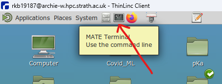

# Tutorials

## Setup (on archie)

First open the terminal:



First clone this repo in archie:
```bash
git clone https://github.com/Tuttlelab/Tutorials
cd Tutorials
```

Now load anaconda:
```bash
module load anaconda/python-3.8.8/2021.05
```

You will need to setup your own environment on archie to install all the required packages (you can call it whatever you want (no spaces) instead of 'myenv')

```bash
conda create -n myenv python=3.9 juypter
```

Now to enter this environment (and you will have to re-enter it every time you open a new terminal or tab in the terminal):

```bash
source activate myenv
```

Now install within this environment the remaining packages that are part of this tutorial

```bash
pip install numpy scipy matplotlib scikit-learn pandas
```


